# Protocol Documentation
<a name="top"></a>

## Table of Contents

- [Protocol Documentation](#protocol-documentation)
  - [Table of Contents](#table-of-contents)
  - [service.proto](#serviceproto)
    - [GameDuelService](#gameduelservice)
    - [General function](#general-function)
      - [CreateGame](#creategame)
        - [Work Flow](#work-flow)
      - [GetGameData](#getgamedata)
        - [Work Flow](#work-flow-1)
      - [QuitGame](#quitgame)
        - [Work Flow](#work-flow-2)
      - [InstSetEventCard](#instseteventcard)
    - [Event Phase : Common handle](#event-phase--common-handle)
      - [EventPhaseConfirm](#eventphaseconfirm)
      - [EventPhaseResult](#eventphaseresult)
      - [work flow](#work-flow-3)
    - [Draw Phase](#draw-phase)
      - [DrawPhaseConfirm](#drawphaseconfirm)
      - [Work Flow](#work-flow-4)
    - [Move PHase](#move-phase)
      - [MovePhaseConfirm](#movephaseconfirm)
      - [MovePhaseResult](#movephaseresult)
      - [Work Flow](#work-flow-5)
    - [Attack / Defence Phase](#attack--defence-phase)
      - [ADPhaseConfirm](#adphaseconfirm)
        - [Work Flow for Attacker (Attack-Card-Drop-Phase)](#work-flow-for-attacker-attack-card-drop-phase)
        - [Work Flow for Defence (Defence-Card-Drop-Phase)](#work-flow-for-defence-defence-card-drop-phase)
      - [ADPhaseResult](#adphaseresult)
        - [Work Flow](#work-flow-6)
      - [ADPhaseDiceResult](#adphasediceresult)
    - [Change Phase](#change-phase)
      - [ChangePhaseConfirm](#changephaseconfirm)
      - [ChangePhaseResult](#changephaseresult)
  - [Scalar Value Types](#scalar-value-types)
  
- [Scalar Value Types](#scalar-value-types)


<a name="service.proto"></a>
<p align="right"><a href="#top">Top</a></p>

## service.proto


 

 

 


<a name="ULZProto.GameDuelService"></a>

### GameDuelService
ANCHOR: service-func for GameDuelService
SECTION: service.proto

Basic Server Function

| Method Name        | Request Type                                       | Response Type                                      | Description                                                                                                                                                                                                                                                                                           |
| ------------------ | -------------------------------------------------- | -------------------------------------------------- | ----------------------------------------------------------------------------------------------------------------------------------------------------------------------------------------------------------------------------------------------------------------------------------------------------- |
| CreateGame         | [GDCreateReq](#ULZProto.GDCreateReq)               | [GameDataSet](#ULZProto.GameDataSet)               |                                                                                                                                                                                                                                                                                                       |
| GetGameData        | [GDGetInfoReq](#ULZProto.GDGetInfoReq)             | [GameDataSet](#ULZProto.GameDataSet)               |                                                                                                                                                                                                                                                                                                       |
| QuitGame           | [GDCreateReq](#ULZProto.GDCreateReq)               | [Empty](#ULZProto.Empty)                           |                                                                                                                                                                                                                                                                                                       |
| InstSetEventCard   | [GDInstanceDT](#ULZProto.GDInstanceDT)             | [Empty](#ULZProto.Empty)                           | GameSet Logic Function instance card move                                                                                                                                                                                                                                                             |
| DrawPhaseConfirm   | [GDGetInfoReq](#ULZProto.GDGetInfoReq)             | [Empty](#ULZProto.Empty)                           | Draw-phase : confirm  NOTE: After Broadcast Send \< [ refill_action_card_phase ]\>, Client set the event-card by \<  InstSetEventCard \> { from their deck to own hand }; then, send this \<  DrawPhaseConfirm \> to notify the server that `client ready to start next phase [move_card_drop_phase]` |
| MovePhaseConfirm   | [GDMoveConfirmReq](#ULZProto.GDMoveConfirmReq)     | [Empty](#ULZProto.Empty)                           | Move-phase : confirm NOTE: After Broadcast Send \< [ move_card_drop_phase ]\>, Client set the event-card by \<  InstSetEventCard \> { from their own hand to out-side }; Then send this \<  MovePhaseConfirm \> to notify the server that `client ready to start next phase [determine_move_phase]`   |
| MovePhaseResult    | [GDGetInfoReq](#ULZProto.GDGetInfoReq)             | [GDMoveConfirmResp](#ULZProto.GDMoveConfirmResp)   |                                                                                                                                                                                                                                                                                                       |
| ADPhaseConfirm     | [GDADConfirmReq](#ULZProto.GDADConfirmReq)         | [Empty](#ULZProto.Empty)                           |                                                                                                                                                                                                                                                                                                       |
| ADPhaseResult      | [GDGetInfoReq](#ULZProto.GDGetInfoReq)             | [GDADResultResp](#ULZProto.GDADResultResp)         |                                                                                                                                                                                                                                                                                                       |
| ADPhaseDiceResult  | [GDGetInfoReq](#ULZProto.GDGetInfoReq)             | [GDADDiceResult](#ULZProto.GDADDiceResult)         |                                                                                                                                                                                                                                                                                                       |
| ChangePhaseConfirm | [GDChangeConfirmReq](#ULZProto.GDChangeConfirmReq) | [Empty](#ULZProto.Empty)                           | ChangeCharaPhase : Confirm and Result FIXME : 3v3 may need it, but 1v1 is not implement;                                                                                                                                                                                                              |
| ChangePhaseResult  | [GDGetInfoReq](#ULZProto.GDGetInfoReq)             | [Empty](#ULZProto.Empty)                           | ChangeCharaPhase : Confirm and Result FIXME : 3v3 may need it, but 1v1 is not implement;                                                                                                                                                                                                              |
| EventPhaseConfirm  | [GDPhaseConfirmReq](#ULZProto.GDPhaseConfirmReq)   | [Empty](#ULZProto.Empty)                           | Event-Phase : Confirm NOTE: Once the Server send any phase notify the client may send feedback to server that ready for phase                                                                                                                                                                         |
| EventPhaseResult   | [GDGetInfoReq](#ULZProto.GDGetInfoReq)             | [GDPhaseConfirmResp](#ULZProto.GDPhaseConfirmResp) | Event-Phase : Confirm NOTE: Once the Server send any phase notify the client may send feedback to server that ready for phase                                                                                                                                                                         |

---

### General function 

#### CreateGame         
create gameset data to Redis 
- Request : [GDCreateReq](#ULZProto.GDCreateReq)               
- Response : [GameDataSet](#ULZProto.GameDataSet)               

##### Work Flow
remark: the gameset not pack `HostEventCardDeck` , `DuelEventCardDeck` , `PhaseSnapMod`, `EffectNodeSnapMod`  into same Redis store position, since it will grow larger and usually get/set during the game.

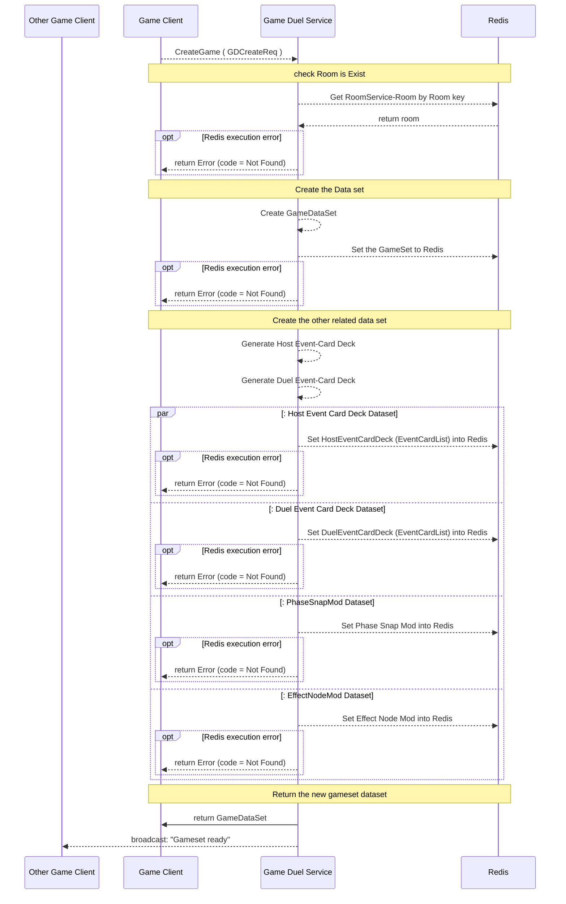


#### GetGameData        
get the gameset data from Redis
- Request : [GDGetInfoReq](#ULZProto.GDGetInfoReq)             
- Response : [GameDataSet](#ULZProto.GameDataSet)               


##### Work Flow


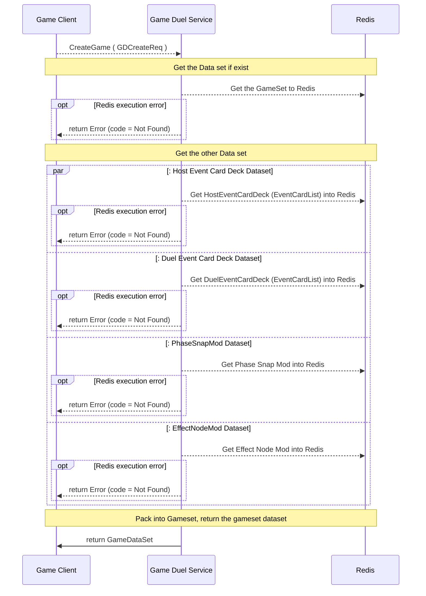

#### QuitGame           
end the game, to clear the game data from Redis, broadcast the message if the game is sudden quit game. 
- Request : [GDCreateReq](#ULZProto.GDCreateReq)               
- Response : [Empty](#ULZProto.Empty)                           
##### Work Flow

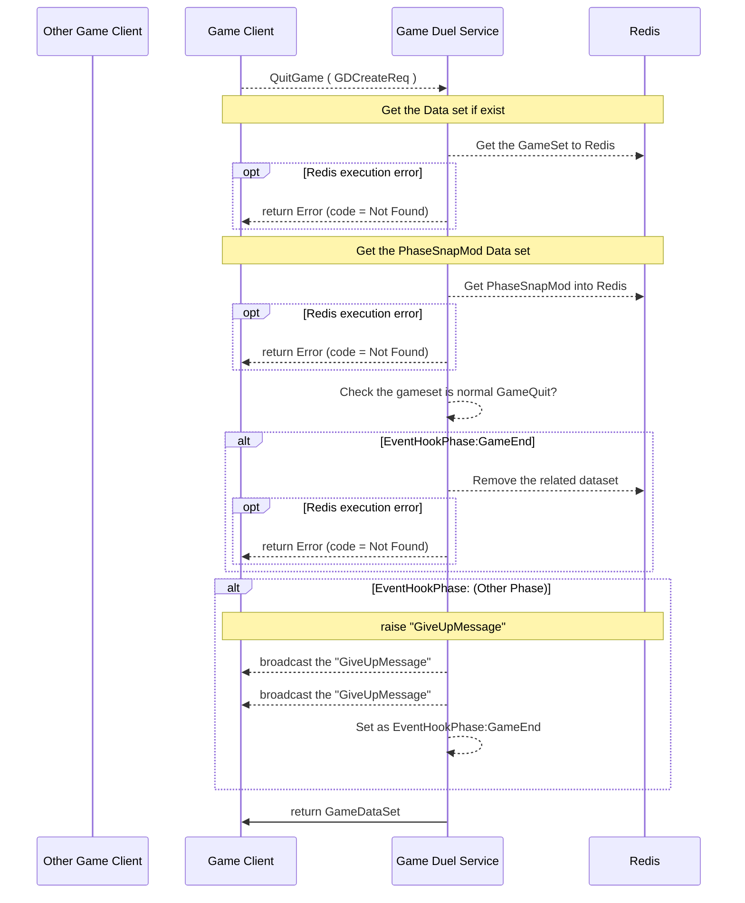
 
#### InstSetEventCard    
- Request : [GDInstanceDT](#ULZProto.GDInstanceDT)            
- Response:  [Empty](#ULZProto.Empty)                           
instance event card move 
Remark: client should reduce the frequence of requesting this 
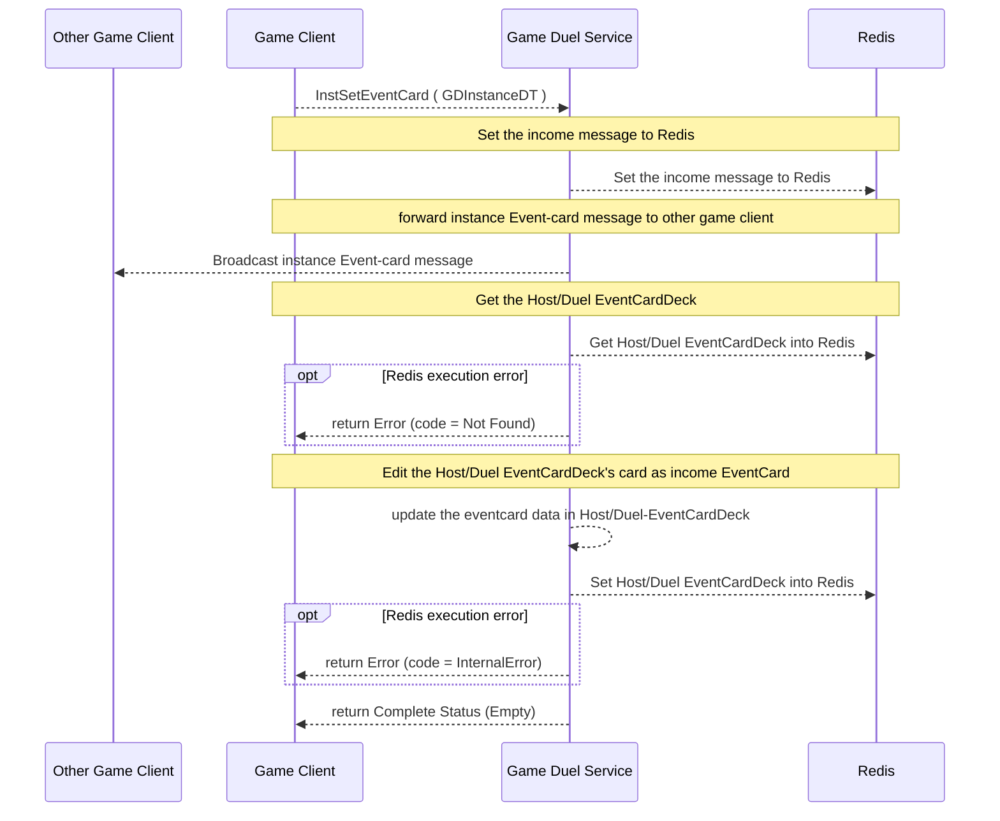
### Event Phase : Common handle 


#### EventPhaseConfirm  
- Request : [GDPhaseConfirmReq](#ULZProto.GDPhaseConfirmReq)   
- Response : [Empty](#ULZProto.Empty)                           

  Event-Phase : Confirm 
  <!-- NOTE: Once the Server send any phase notify the client may send feedback to server that ready for phase  -->
  Current no implement for it 


#### EventPhaseResult   
- Request : [GDGetInfoReq](#ULZProto.GDGetInfoReq)             
- Response : [GDPhaseConfirmResp](#ULZProto.GDPhaseConfirmResp) 

Event-Phase : Confirm 

NOTE: Once the Server send any phase notify the client may send feedback to server that ready for phase 

```c
// ----- any phase with hook-type : before . after
[any_phase:before] {
  executeEffectNode()
}

[any_phase:after] {
  executeEffectNode()
}


// ---- start_turn_phase
[start_turn_phase:proxy] {
  1. turn ++

}
// -------------------------------------
// draw-phase
// ---- refill_action_card_phase
[refill_action_card_phase:proxy] {

}

// ---- determine_battle_point_phase
[determine_battle_point_phase:proxy] {
  1. skill calculation
}

// ----- battle_result_phase
[battle_result_phase : proxy] {
  1. dice-roll from sub-client
  2. store dice-roll first-result
}
// ----- damage_phase -----
[damage_phase : proxy] {

}
// ----- dead_chara_change_phase -----
[dead_chara_change_phase : proxy] {

}
// ----- determine_dead_chara_change_phase -----
[determine_dead_chara_change_phase : proxy] {

}

```

#### work flow 


---
### Draw Phase

Draw-phase : confirm  
NOTE: After Broadcast Send 
[refill_action_card_phase], Client set the event-card by \<InstSetEventCard\> { from their deck to own hand }; 
then, send this \<DrawPhaseConfirm\> to notify the server that `client ready to start next phase [move_card_drop_phase]` 


#### DrawPhaseConfirm   
- Request : [GDGetInfoReq](#ULZProto.GDGetInfoReq)             
- Response: [Empty](#ULZProto.Empty)                          

this comfirm request is for response the GameDuelService after GDS send the drawed cards to Host player and Duel player
Basically, it is similar with EventPhaseConfirm

#### Work Flow
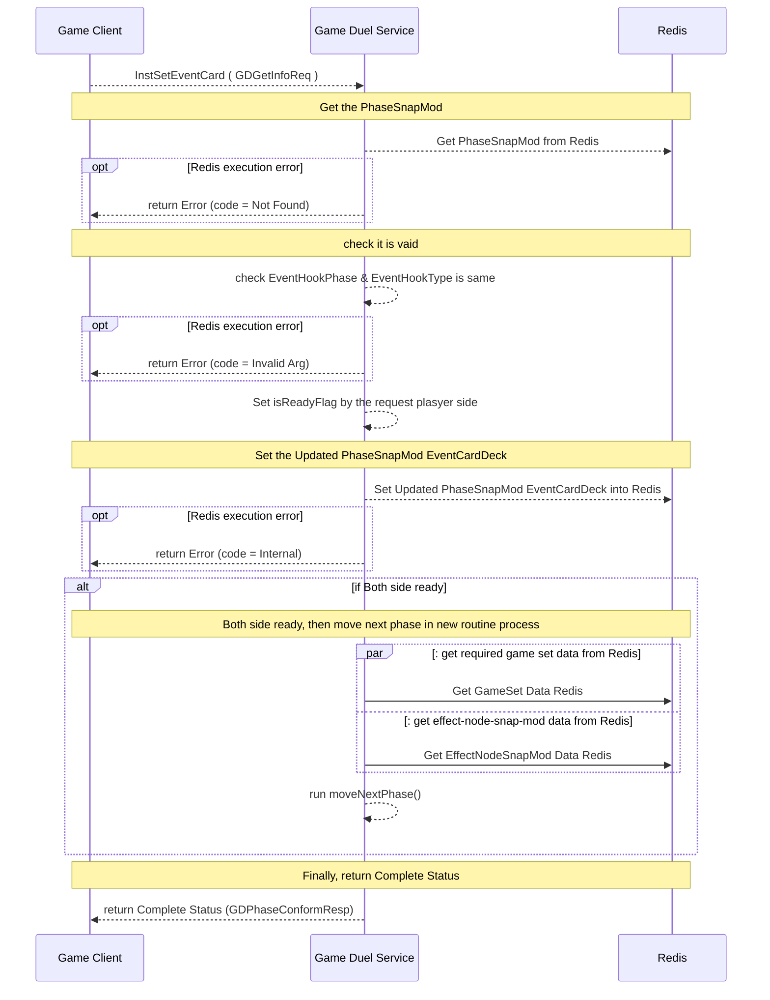


---
### Move PHase
 
Move-phase : confirm 
 
NOTE: After Broadcast Send \<[move_card_drop_phase]\>, Client set the event-card by \<InstSetEventCard\> { from their own hand to out-side }; Then send this \<MovePhaseConfirm\> to notify the server that `client ready to start next phase [determine_move_phase]`   


#### MovePhaseConfirm   
- Request: [GDMoveConfirmReq](#ULZProto.GDMoveConfirmReq)     
- Response: [Empty](#ULZProto.Empty)                           


#### MovePhaseResult    
- Request :  [GDGetInfoReq](#ULZProto.GDGetInfoReq)             
- Response: [GDMoveConfirmResp](#ULZProto.GDMoveConfirmResp)   


#### Work Flow
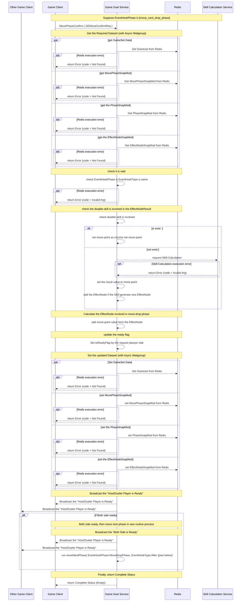

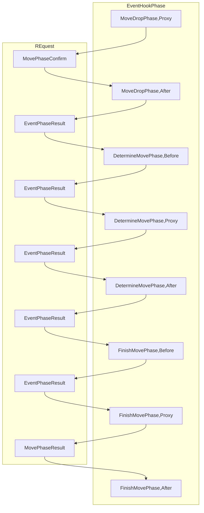


---
### Attack / Defence Phase


#### ADPhaseConfirm     
- Request : [GDADConfirmReq](#ULZProto.GDADConfirmReq)         
- Response : [Empty](#ULZProto.Empty)                           


##### Work Flow for Attacker (Attack-Card-Drop-Phase) 
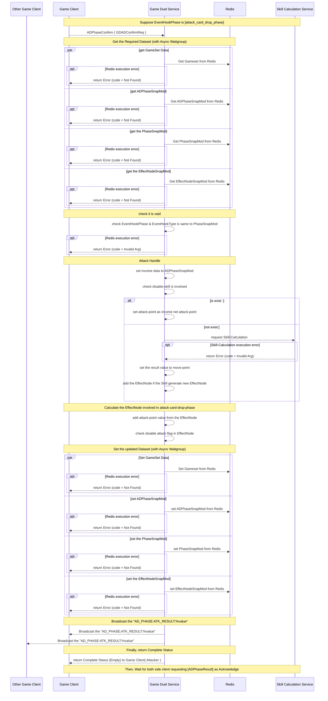
---
##### Work Flow for Defence (Defence-Card-Drop-Phase) 
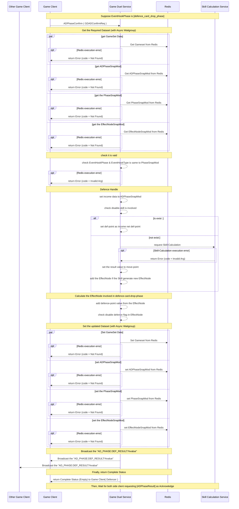

#### ADPhaseResult      
- Request : [GDGetInfoReq](#ULZProto.GDGetInfoReq)             
- Response : [GDADResultResp](#ULZProto.GDADResultResp)         

##### Work Flow
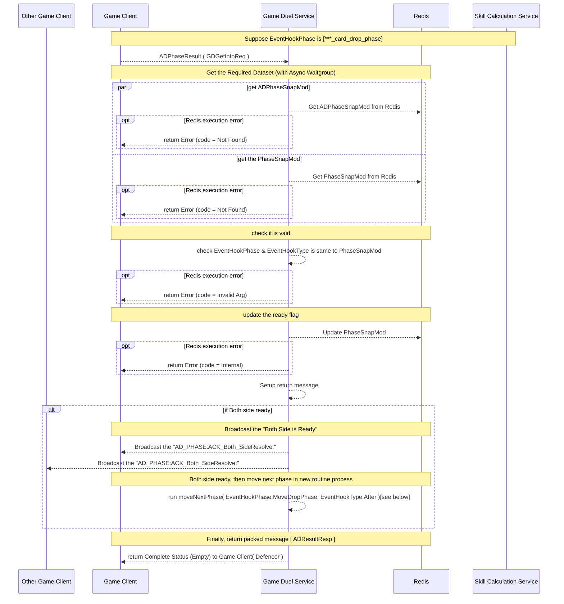


#### ADPhaseDiceResult  
- Request : [GDGetInfoReq](#ULZProto.GDGetInfoReq)             
- Response : [GDADDiceResult](#ULZProto.GDADDiceResult)         

Important: Code is not implement

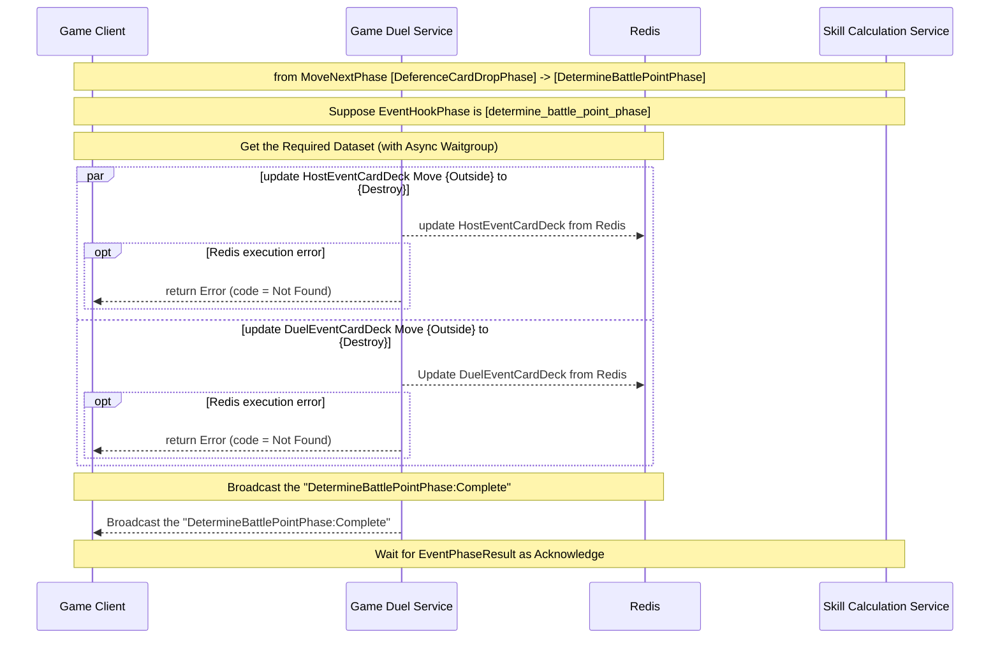
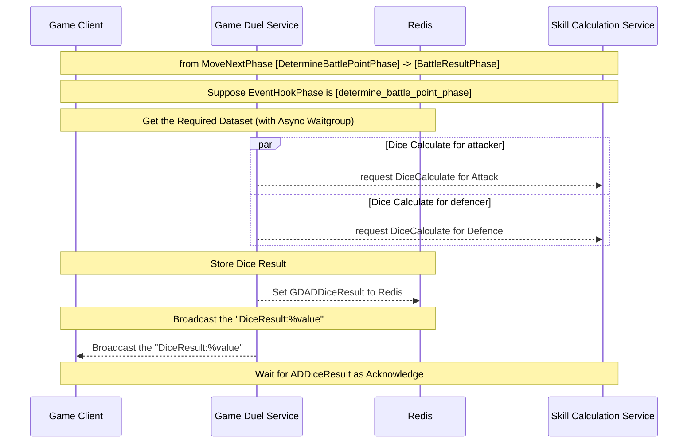

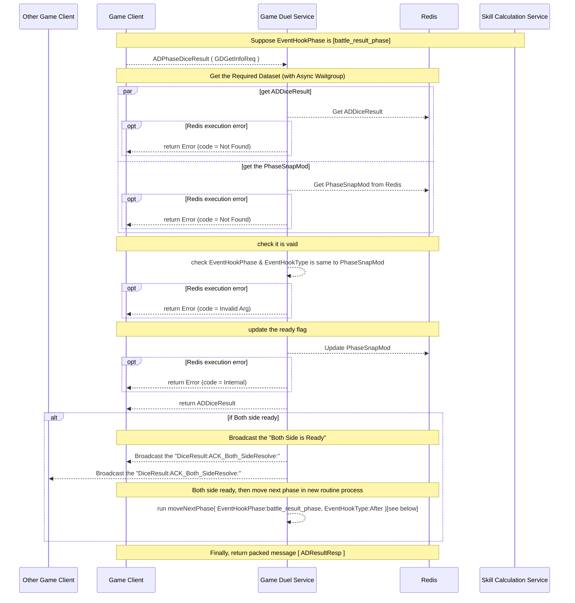


---
### Change Phase

#### ChangePhaseConfirm 
- Request : [GDChangeConfirmReq](#ULZProto.GDChangeConfirmReq) 
- Response : [Empty](#ULZProto.Empty)                           

ChangeCharaPhase : Confirm and Result 

FIXME : 3v3 may need it, but 1v1 is not implement;

#### ChangePhaseResult  
- Request : [GDGetInfoReq](#ULZProto.GDGetInfoReq)             
- Response : [Empty](#ULZProto.Empty)                           

ChangeCharaPhase : Confirm and Result 

FIXME : 3v3 may need it, but 1v1 is not  implement;

---


## Scalar Value Types

| .proto Type                    | Notes                                                                                                                                           | C++    | Java       | Python      | Go      | C#         | PHP            | Ruby                           |
| ------------------------------ | ----------------------------------------------------------------------------------------------------------------------------------------------- | ------ | ---------- | ----------- | ------- | ---------- | -------------- | ------------------------------ |
| <a name="double" /> double     |                                                                                                                                                 | double | double     | float       | float64 | double     | float          | Float                          |
| <a name="float" /> float       |                                                                                                                                                 | float  | float      | float       | float32 | float      | float          | Float                          |
| <a name="int32" /> int32       | Uses variable-length encoding. Inefficient for encoding negative numbers – if your field is likely to have negative values, use sint32 instead. | int32  | int        | int         | int32   | int        | integer        | Bignum or Fixnum (as required) |
| <a name="int64" /> int64       | Uses variable-length encoding. Inefficient for encoding negative numbers – if your field is likely to have negative values, use sint64 instead. | int64  | long       | int/long    | int64   | long       | integer/string | Bignum                         |
| <a name="uint32" /> uint32     | Uses variable-length encoding.                                                                                                                  | uint32 | int        | int/long    | uint32  | uint       | integer        | Bignum or Fixnum (as required) |
| <a name="uint64" /> uint64     | Uses variable-length encoding.                                                                                                                  | uint64 | long       | int/long    | uint64  | ulong      | integer/string | Bignum or Fixnum (as required) |
| <a name="sint32" /> sint32     | Uses variable-length encoding. Signed int value. These more efficiently encode negative numbers than regular int32s.                            | int32  | int        | int         | int32   | int        | integer        | Bignum or Fixnum (as required) |
| <a name="sint64" /> sint64     | Uses variable-length encoding. Signed int value. These more efficiently encode negative numbers than regular int64s.                            | int64  | long       | int/long    | int64   | long       | integer/string | Bignum                         |
| <a name="fixed32" /> fixed32   | Always four bytes. More efficient than uint32 if values are often greater than 2^28.                                                            | uint32 | int        | int         | uint32  | uint       | integer        | Bignum or Fixnum (as required) |
| <a name="fixed64" /> fixed64   | Always eight bytes. More efficient than uint64 if values are often greater than 2^56.                                                           | uint64 | long       | int/long    | uint64  | ulong      | integer/string | Bignum                         |
| <a name="sfixed32" /> sfixed32 | Always four bytes.                                                                                                                              | int32  | int        | int         | int32   | int        | integer        | Bignum or Fixnum (as required) |
| <a name="sfixed64" /> sfixed64 | Always eight bytes.                                                                                                                             | int64  | long       | int/long    | int64   | long       | integer/string | Bignum                         |
| <a name="bool" /> bool         |                                                                                                                                                 | bool   | boolean    | boolean     | bool    | bool       | boolean        | TrueClass/FalseClass           |
| <a name="string" /> string     | A string must always contain UTF-8 encoded or 7-bit ASCII text.                                                                                 | string | String     | str/unicode | string  | string     | string         | String (UTF-8)                 |
| <a name="bytes" /> bytes       | May contain any arbitrary sequence of bytes.                                                                                                    | string | ByteString | str         | []byte  | ByteString | string         | String (ASCII-8BIT)            |

